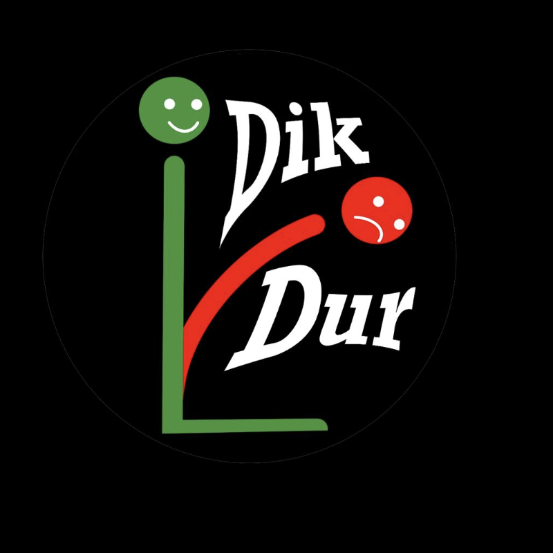
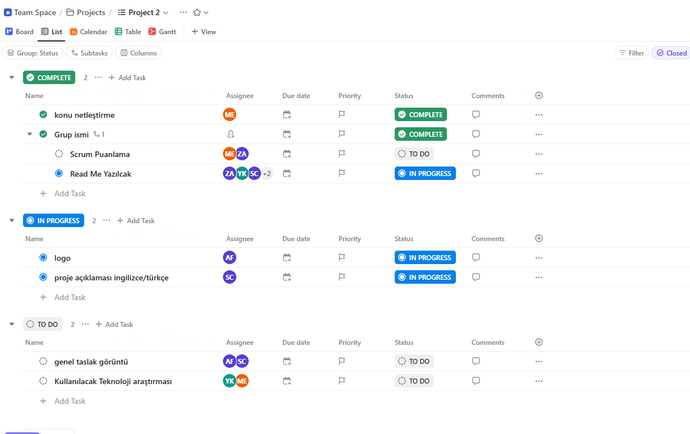
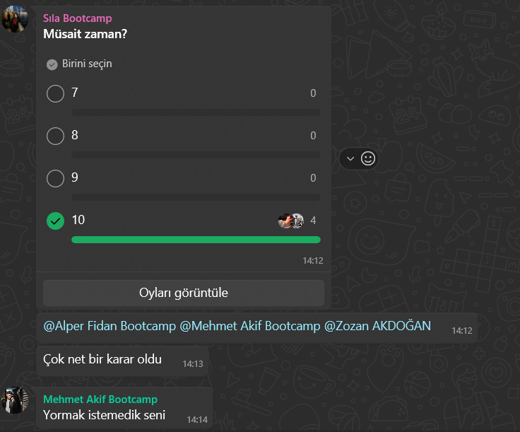
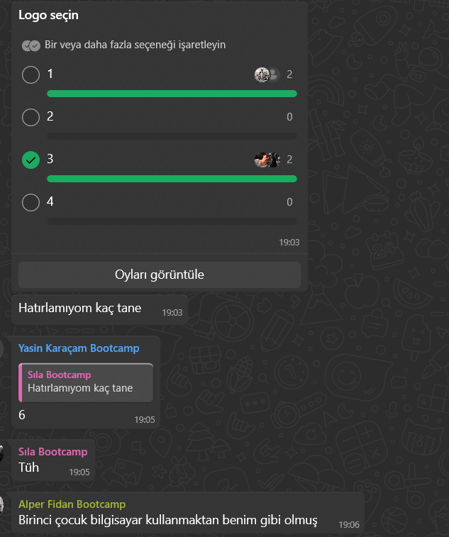
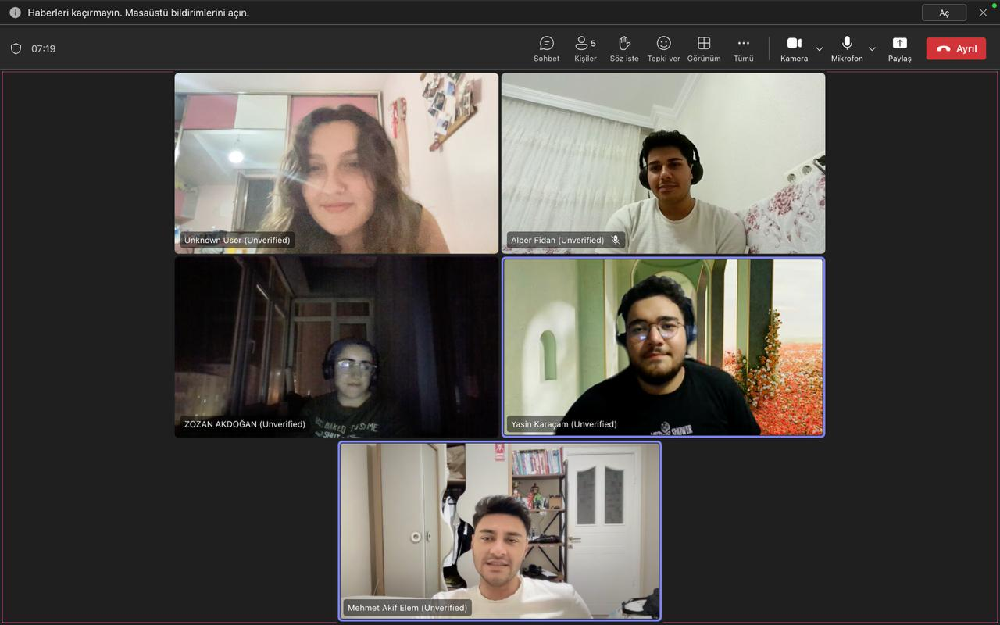
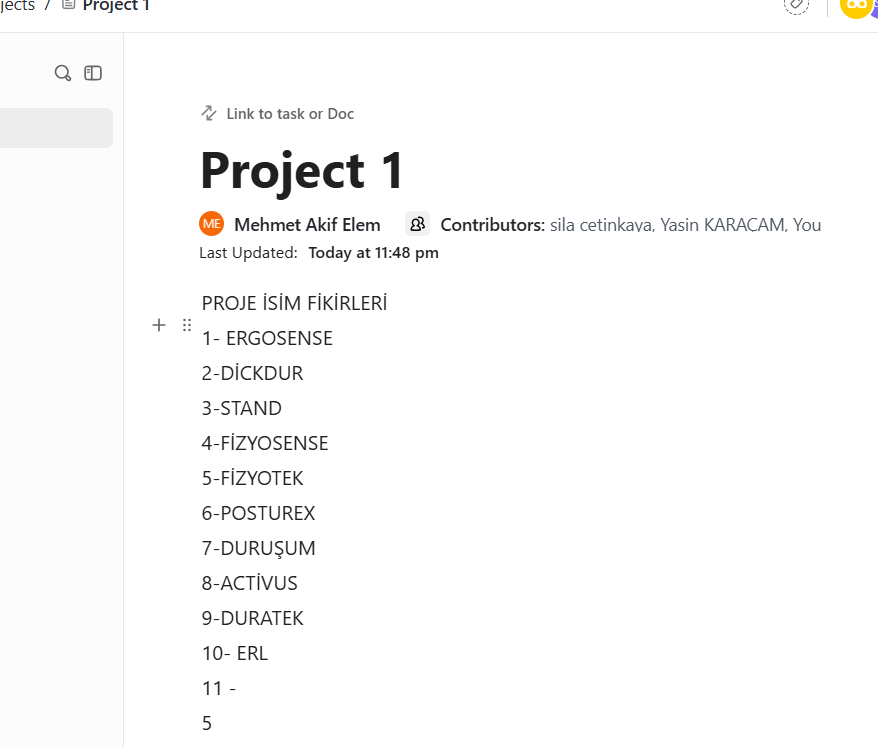

 

# **TEAM NAME:**  
- **BOOTCAMP101**  

# **TEAM MEMBERS:**
| Name | Title | Social |
|:-------:| :-----:| :--------:|
| <a href="https://github.com/AidenLM" style="text-decoration:none; color:blue;">Mehmet Akif Elem</a> | Scrum Master |  |
| <a href="https://github.com/kedigelisimci" style="text-decoration:none; color:blue;">Zozan Akdoğan </a> | Product Owner |  |
| <a href="https://github.com/alperfidan" style="text-decoration:none; color:blue;">Alper Fidan</a> | Developer |  |
| <a href="https://github.com/yasinkrcm" style="text-decoration:none; color:blue;">Yasin Karaçam </a> | Developer |  |
| <a href="https://github.com/silacetinkaya" style="text-decoration:none; color:blue;">Sıla Çetinkaya </a> | Developer |  |

<H2>PRODUCT BACKLOGS:</H2>

<A HREF="https://app.clickup.com/90151335937/v/s/90155373300">DİKDUR CLİCK UP</A>

  
<h2>ABOUT PROJECT</h2>

**DikDur** is an AI-powered, socially interactive, and data-driven corporate physiotherapy platform designed to improve employee health, reduce posture disorders, and enhance team motivation.  

### **Key Objectives:**  
✔ Ergonomic and physical therapy solutions for hybrid/remote workers  
✔ Gamified wellness challenges to boost team interaction  
✔ Customized health reporting for companies to optimize workforce productivity  
✔ Turkey-wide physiotherapist/ergotherapist network for quick appointments and online therapy  

---

### **1. Employee Health Monitoring Dashboard (HR Dashboard)**  
- **Anonymous Posture Scoring:** Department-based posture analysis to identify risk groups  
- **Ergonomics Reports:** Personalized workstation setup recommendations based on sitting duration and movement frequency  
- **Absenteeism Analysis:** Measuring the impact of musculoskeletal issues on employee performance  

### **2. Team Social Interaction & Gamification**  
- **Interdepartmental DikDur Challenges:**  
  - Weekly *"Best Posture Team"* competition (scoring based on exercise completion and posture scores)  
  - Winning team receives gym discounts or health bonuses  
- **In-App Chat & Forum:**  
  - Social space for employees to share exercises  
  - Live Q&A with physiotherapists  

### **3. Virtual Physical Therapy & Ergotherapist Network**  
- **Turkey-Wide Physiotherapist Map:**  
  - Find local specialists and book online/in-person appointments  
- **Mobile Physiotherapy for Hybrid Workers:**  
  - Video consultations and home exercise programs for remote employees  

### **4. Smart Reminders & AI-Assisted Systems**  
- **Push Notification Breaks:**  
  - *"You've been sitting for 30 minutes – time for a 2-minute stretch!"*  
- **Voice Assistant (AI Coach):**  
  - *"Hey DikDur, what are today's back exercises?"*  
- **AI-Powered Ergonomics Assistant:**  
  - Real-time posture correction via webcam analysis  

### **5. Group Therapy & Wellness Events**  
- **Live Group Exercises:**  
  - *"Posture Breaks"* – 10-minute office workouts 3x weekly  
- **Webinar Series:**  
  - Trainings like *"Proper Office Posture"* and *"Relieving Back Pain"*  
- **1-on-1 Expert Sessions:**  
  - Book private consultations through the platform  

### **6. Gym Partnerships & Wellness Rewards**  
- **Points-Based Rewards System:**  
  - Redeem DikDur points for discounts at partner gyms  
- **Corporate Memberships:**  
  - Special agreements with fitness centers  

  
<h2>TARGET AUDIENCE</h2>

1. **Corporate Companies (HR & Wellness Departments)**  
   - Medium and large-scale enterprises  
   - Especially companies with desk-bound employees  
2. **Hybrid/Remote Professionals**  
   - Office-heavy sectors (IT, finance, marketing, etc.)  
3. **Physiotherapists & Ergotherapists**  
   - Professionals offering consultations through the platform  
   - Private clinics and healthcare centers  
4. **Gyms & Wellness Centers**  
   - Collaborative fitness partners  
5. **Insurance Companies**  
   - Integration with corporate health packages  

---

  
<h2>Team Managment(Click Up Photo)</h2>

   

  

---

  
<h1>Sprint 1</h1>

  
## **SPRINT SCORING:**  
At the beginning of the sprint, we set a total score of **10 points** for the team, divided as follows:  
## ✅ Sprint Scoring Table

| 📝 **Task**                                   | 🔥 **Priority** | 🎯 **Points** | ✅ **Status**     |
|-----------------------------------------------|------------------|---------------|-------------------|
| Team Dynamics Established                     | High             | 20            | Completed ✅       |
| Creating a Shared Workspace & Participation   | High             | 20            | Completed ✅       |
| Topic Selection & Research                    | Medium           | 20            | Completed ✅       |
| Product Naming                                | Medium           | 20            | Completed ✅       |
| Team Logo Selection                           | Low              | 20            | Completed ✅       |
| **Total**                                     |                  | **100**       | **Completed ✅**   |

**Goal Achieved – Full 100 Points Earned!**  

## **SPRINT NOTES:**
- Active communication was maintained throughout Sprint 1.
- Task assignments and tracking were managed via ClickUp.
- The project name, target audience, and core features were defined.
- Team logo was created and visuals for presentations were prepared.
- Initial idea phase was completed, and wireframe designs were initiated.
- Tasks were equally distributed following Scrum methodology.
- Progress was tracked through daily meetings.
- Full score was achieved by reaching all sprint goals.
 

## **DAILY MEETINGS:**  
After an initial live evaluation, we scheduled meetings based on team availability (considering university schedules and exams).  
- **Frequency:** At least twice a week → Later shifted to daily check-ins  
- **Time:** Every other day, 10 AM–12 PM  
- **Platforms:** Google Meets & WhatsApp

## **PRODUCT STATUS:**  
The product is currently in the idea and design phase. Initial screen drafts for the user panel, health scores, and interactive features have been discussed within the team and design work has begun. In the upcoming sprints, the aim is to prepare the first prototypes.

## **DEVELOPMENT PROCESS:**  
- All team members participated in every step (no sub-teams).  
- Decisions were made democratically through voting.  

 

## **SPRINT REVIEW:**  
Our first sprint successfully achieved its interim goals, and the project started smoothly. Healthy communication was maintained during discussions, which is crucial for teamwork.  

## **SPRINT RETROSPECTIVE:**  
- Our main goals were **team bonding & project structuring**.  
- We reached the **full 10-point target**.  
- Future sprints will follow the same **5 key sub-goals per sprint**.  

## **PROBLEMS & OBSTACLES:**  
- A **late start** initially put us behind, but strong team dynamics helped compensate for it.

  
<h1>Sprint 2</h1>

### 🌐 Website **  

The official website of the DikDur project is live and available at:  
[https://dik-dur-website.vercel.app/](https://dik-dur-website.vercel.app/)

Here, users can explore the app features, learn about posture analysis, and get insights on challenges directly through a clean and user-friendly interface. The website complements the mobile application by providing detailed information and a smooth browsing experience.

Feel free to visit and try out the functionalities showcased in the screenshots below!

### ✅ ** WEBSITE SCREENSHOTS**  
<h3>🔹 Home Screen</h3>

<h3>🔹 Register Screen</h3>

<h3>🔹 Activities Screen</h3>

<h3>🔹 Posture Screen</h3>

<h3>🔹 Posture Analysis Screen</h3>

<h3>🔹 Challenges Screen</h3>

---

### 🗂 **PROJECT MANAGEMENT**  

All Sprint 2 tasks were assigned, tracked, and reviewed via [ClickUp](https://app.clickup.com/90151335937/v/dc/2kyq0e01-735).  
- Feature implementations were divided into smaller tasks  
- Progress was monitored through the ClickUp board  
- Color palette decisions and pair programming matches were voted directly within ClickUp discussions
  
#### Sprint Board  

---

### 📉 **BURNDOWN CHART**  

## 🏃 Sprint 2 Task Table

| Task                                                                 | Priority       | Points | Status   |
|----------------------------------------------------------------------|----------------|--------|----------|
| Decide color palette                                                 | 🔴 High        | 5      | ✅ Done   |
| Assign pair programming duties                                       | 🔴 High        | 10     | ✅ Done   |
| Daily Scrum scoring & burnout tracking                               | 🔴 High        | 10     | ✅ Done   |
| Daily WhatsApp chats added regularly to GitHub                       | 🔴 High        | 10     | ✅ Done   |
| Write meeting summaries                                              | 🔴 High        | 10     | ✅ Done   |
| Write and edit README file                                           | 🔴 High        | 10     | ✅ Done   |
| Design Figma layout                                                  | 🔴 High        | 20     | ✅ Done   |
| Set up login and authentication after draft website is ready         | 🟠 Medium      | 30     | ✅ Done   |
| Start working on selected technology                                 | 🟠 Medium      | 20     | ✅ Done   |
| Define website concept                                               | 🟢 Low         | 15     | ✅ Done   |
| Decide which technology to use                                       | 🟢 Low         | 10     | ✅ Done   |

**✅ Total Points: 150 — All tasks completed!**
We maintained a burndown chart to track sprint velocity and ensure on-time delivery of features.

Initial backlog estimation: 150 Story Points

Final delivery: 150 Story Points Completed

We earned 100 points in the first sprint and 150 points in the second. With the third sprint, our goal is to reach a total of 400 points. This shows how our teamwork and communication keep improving each sprint.

## 🏃 Sprint 2 Burndown Chart 

---
### 💬 **WHATSAPP CHAT**  
Daily coordination and updates were managed on WhatsApp:  
- Task follow-ups  
- Urgent issue resolutions  

Here are some screenshots from our WhatsApp communication and workflow discussions:

  
  
  
  
  

---

### 🎥 **MEETING SCREENSHOTS**  
Meetings were held regularly to review progress and assign tasks:  
- Sprint Planning & Mid-Sprint Review  
- UI/UX walkthroughs  
- Code merge and functionality discussion  

---
## 🚀 Sprint 2 Review & Retrospective

### ✅ Sprint 2 Review

During Sprint 2, significant progress was made in the development of the DikDur platform. We focused on building out the core user-facing components and ensuring that the user flow became more consistent and intuitive. Key accomplishments include:

- The initial version of the **DikDur web platform** was successfully deployed: [dik-dur-website.vercel.app](https://dik-dur-website.vercel.app/)
- Several critical user interfaces were designed and partially implemented:
  - **Login and Registration pages**
  - **HR Dashboard** with posture analytics
  - **Gamification Panel** for challenges and rewards
  - **Virtual Appointment Interface** for physiotherapy sessions
- Navigation between screens was established.
- Design assets (e.g., Figma files) were shared to align development with visual design.

Despite these achievements, Sprint 2 also presented several collaboration and timing challenges.

---

### ⚠️ Challenges Faced During Sprint 2

- 🏖️ **Vacation & Mobility Issues**  
  The sprint took place during the summer break, which meant that many team members were traveling or temporarily unavailable. This affected meeting consistency and timely task completion.

- 💼 **Internship Commitments**  
  Several team members were also doing internships. Their differing schedules made synchronous collaboration difficult and reduced working hours across the team.

- 📚 **Knowledge Gaps**  
  There were noticeable differences in experience and familiarity with tools among team members. Some had advanced technical knowledge while others were still learning, which caused task imbalances and delays.

- 💬 **Asynchronous Communication**  
  Most of our communication happened on WhatsApp and other asynchronous platforms due to differing schedules. While this kept the team connected, it made quick decision-making and technical alignment harder.

---

### 🔁 Retrospective – Lessons Learned & Recommendations

| Observation | Recommendation |
|-------------|----------------|
| Sprint overlapped with vacations and internships | Use availability calendars before sprints and assign critical tasks accordingly |
| Technical experience levels varied | Encourage mentoring, pair programming, and mini knowledge-sharing sessions |
| Members changed locations often | Set fixed weekly check-ins regardless of location, with summaries for absentees |
| Overreliance on asynchronous chats | Use shared tools (Notion, Miro) for central task tracking and decisions |
| Lack of documented decisions | Rotate a note-taker each meeting and maintain a visible sprint log |

---

### 📌 Looking Ahead – Sprint 3 Goals

- Begin backend integration: user authentication, HR module, and user data handling
- Complete gamification system implementation
- Prepare and execute early user testing for core flows
- Improve internal processes through better scheduling and knowledge alignment

