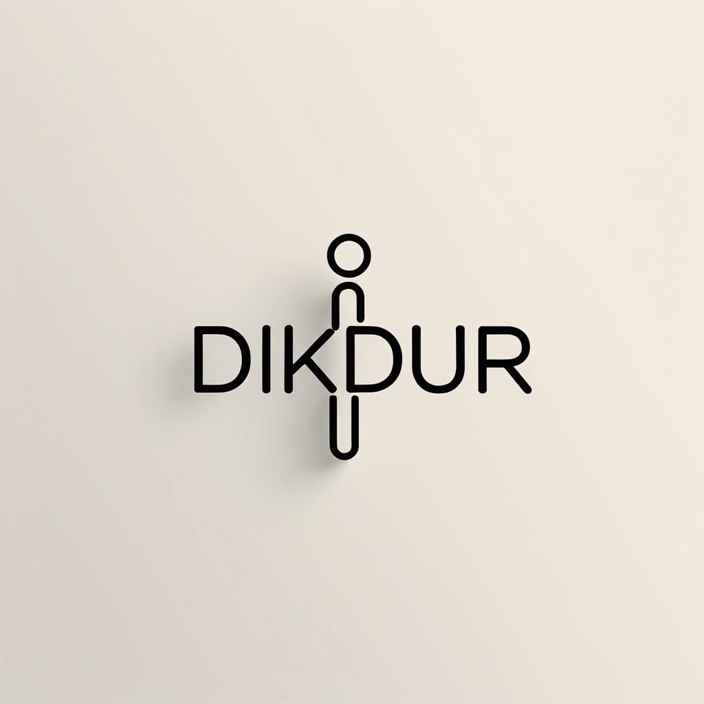 

# **TEAM NAME:BOOTCAMP101**  

# **TEAM MEMBERS:**
| Name | Title | Social |
|:-------:| :-----:| :--------:|
| <a href="https://github.com/AidenLM" style="text-decoration:none; color:blue;">Mehmet Akif Elem</a> | Scrum Master |  |
| <a href="https://github.com/kedigelisimci" style="text-decoration:none; color:blue;">Zozan Akdoğan </a> | Product Owner |  |
| <a href="https://github.com/alperfidan" style="text-decoration:none; color:blue;">Alper Fidan</a> | Developer |  |
| <a href="https://github.com/yasinkrcm" style="text-decoration:none; color:blue;">Yasin Karaçam </a> | Developer |  |
| <a href="https://github.com/silacetinkaya" style="text-decoration:none; color:blue;">Sıla Çetinkaya </a> | Developer |  |

  
<h2>ABOUT PROJECT</h2>

**DikDur** is an AI-powered, socially interactive, and data-driven corporate physiotherapy platform designed to improve employee health, reduce posture disorders, and enhance team motivation.  

### **Key Objectives:**  
✔ Ergonomic and physical therapy solutions for hybrid/remote workers  
✔ Gamified wellness challenges to boost team interaction  
✔ Customized health reporting for companies to optimize workforce productivity  
✔ Turkey-wide physiotherapist/ergotherapist network for quick appointments and online therapy  

---

### **1. Employee Health Monitoring Dashboard (HR Dashboard)**  
- **Anonymous Posture Scoring:** Department-based posture analysis to identify risk groups  
- **Ergonomics Reports:** Personalized workstation setup recommendations based on sitting duration and movement frequency  
- **Absenteeism Analysis:** Measuring the impact of musculoskeletal issues on employee performance  

### **2. Team Social Interaction & Gamification**  
- **Interdepartmental DikDur Challenges:**  
  - Weekly *"Best Posture Team"* competition (scoring based on exercise completion and posture scores)  
  - Winning team receives gym discounts or health bonuses  
- **In-App Chat & Forum:**  
  - Social space for employees to share exercises  
  - Live Q&A with physiotherapists  

### **3. Virtual Physical Therapy & Ergotherapist Network**  
- **Turkey-Wide Physiotherapist Map:**  
  - Find local specialists and book online/in-person appointments  
- **Mobile Physiotherapy for Hybrid Workers:**  
  - Video consultations and home exercise programs for remote employees  

### **4. Smart Reminders & AI-Assisted Systems**  
- **Push Notification Breaks:**  
  - *"You've been sitting for 30 minutes – time for a 2-minute stretch!"*  
- **Voice Assistant (AI Coach):**  
  - *"Hey DikDur, what are today's back exercises?"*  
- **AI-Powered Ergonomics Assistant:**  
  - Real-time posture correction via webcam analysis  

### **5. Group Therapy & Wellness Events**  
- **Live Group Exercises:**  
  - *"Posture Breaks"* – 10-minute office workouts 3x weekly  
- **Webinar Series:**  
  - Trainings like *"Proper Office Posture"* and *"Relieving Back Pain"*  
- **1-on-1 Expert Sessions:**  
  - Book private consultations through the platform  

### **6. Gym Partnerships & Wellness Rewards**  
- **Points-Based Rewards System:**  
  - Redeem DikDur points for discounts at partner gyms  
- **Corporate Memberships:**  
  - Special agreements with fitness centers  

  
<h2>TARGET AUDIENCE</h2>

1. **Corporate Companies (HR & Wellness Departments)**  
   - Medium and large-scale enterprises  
   - Especially companies with desk-bound employees  
2. **Hybrid/Remote Professionals**  
   - Office-heavy sectors (IT, finance, marketing, etc.)  
3. **Physiotherapists & Ergotherapists**  
   - Professionals offering consultations through the platform  
   - Private clinics and healthcare centers  
4. **Gyms & Wellness Centers**  
   - Collaborative fitness partners  
5. **Insurance Companies**  
   - Integration with corporate health packages  

  
<h2>Team Managment</h2>

   

  

  
<h1>Sprint 1</h1>

  
## **SPRINT SCORING:**  
At the beginning of the sprint, we set a total score of **10 points** for the team, divided as follows:  
## ✅ Sprint Scoring Table

| 📝 **Task**                                   | 🔥 **Priority** | 🎯 **Points** | ✅ **Status**     |
|-----------------------------------------------|------------------|---------------|-------------------|
| Team Dynamics Established                     | High             | 20            | Completed ✅       |
| Creating a Shared Workspace & Participation   | High             | 20            | Completed ✅       |
| Topic Selection & Research                    | Medium           | 20            | Completed ✅       |
| Product Naming                                | Medium           | 20            | Completed ✅       |
| Team Logo Selection                           | Low              | 20            | Completed ✅       |
| **Total**                                     |                  | **100**       | **Completed ✅**   |

**Goal Achieved – Full 100 Points Earned!**  

## **SPRINT NOTES:**
- Active communication was maintained throughout Sprint 1.
- Task assignments and tracking were managed via ClickUp.
- The project name, target audience, and core features were defined.
- Team logo was created and visuals for presentations were prepared.
- Initial idea phase was completed, and wireframe designs were initiated.
- Tasks were equally distributed following Scrum methodology.
- Progress was tracked through daily meetings.
- Full score was achieved by reaching all sprint goals.
 

## **DAILY MEETINGS:**  
After an initial live evaluation, we scheduled meetings based on team availability (considering university schedules and exams).  
- **Frequency:** At least twice a week → Later shifted to daily check-ins  
- **Time:** Every other day, 10 AM–12 PM  
- **Platforms:** Google Meets & WhatsApp

## **PRODUCT STATUS:**  
The product is currently in the idea and design phase. Initial screen drafts for the user panel, health scores, and interactive features have been discussed within the team and design work has begun. In the upcoming sprints, the aim is to prepare the first prototypes.

## **DEVELOPMENT PROCESS:**  
- All team members participated in every step (no sub-teams).  
- Decisions were made democratically through voting.  

 

## **SPRINT REVIEW:**  
Our first sprint successfully achieved its interim goals, and the project started smoothly. Healthy communication was maintained during discussions, which is crucial for teamwork.  

## **SPRINT RETROSPECTIVE:**  
- Our main goals were **team bonding & project structuring**.  
- We reached the **full 10-point target**.  
- Future sprints will follow the same **5 key sub-goals per sprint**.  

## **PROBLEMS & OBSTACLES:**  
- A **late start** initially put us behind, but strong team dynamics helped compensate for it.

  
<h1>Sprint 2</h1>

### 🌐 Website **  

The official website of the DikDur project is live and available at:  
[https://dik-dur-website.vercel.app/](https://dik-dur-website.vercel.app/)

Here, users can explore the app features, learn about posture analysis, and get insights on challenges directly through a clean and user-friendly interface. The website complements the mobile application by providing detailed information and a smooth browsing experience.

Feel free to visit and try out the functionalities showcased in the screenshots below!

### ✅ ** WEBSITE SCREENSHOTS**  
<h3>🔹 Home Screen</h3>
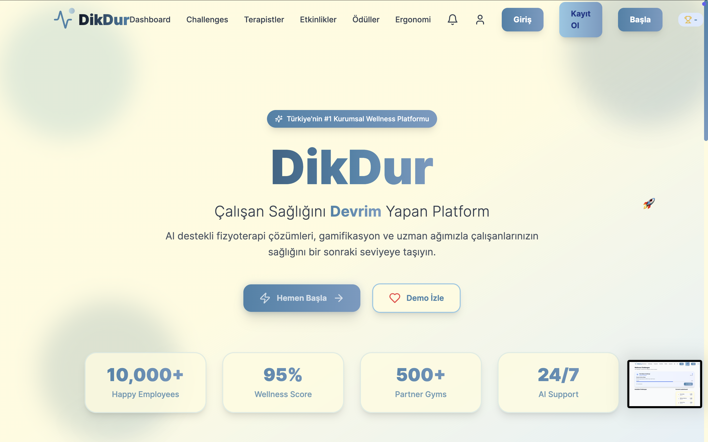

<h3>🔹 Register Screen</h3>
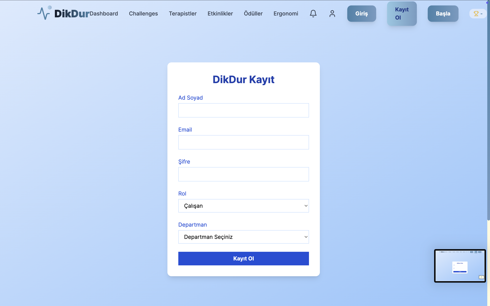

<h3>🔹 Activities Screen</h3>
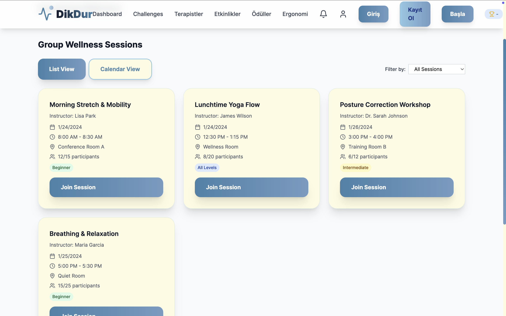

<h3>🔹 Posture Screen</h3>
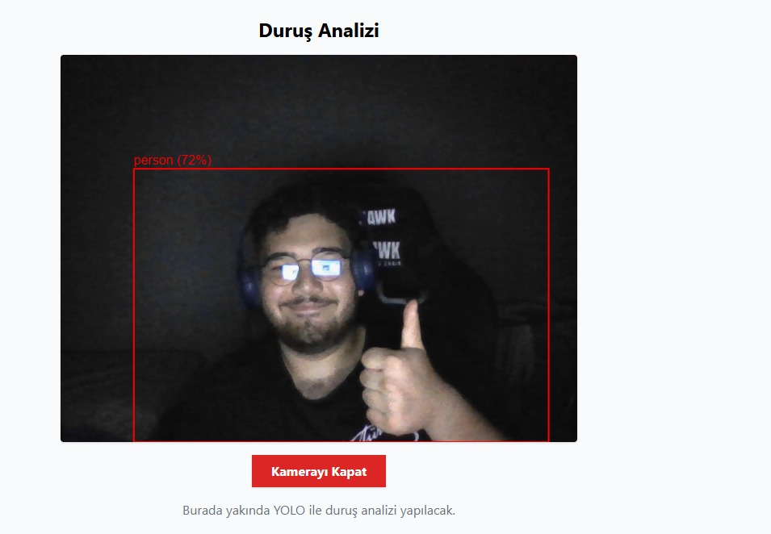

<h3>🔹 Posture Analysis Screen</h3>
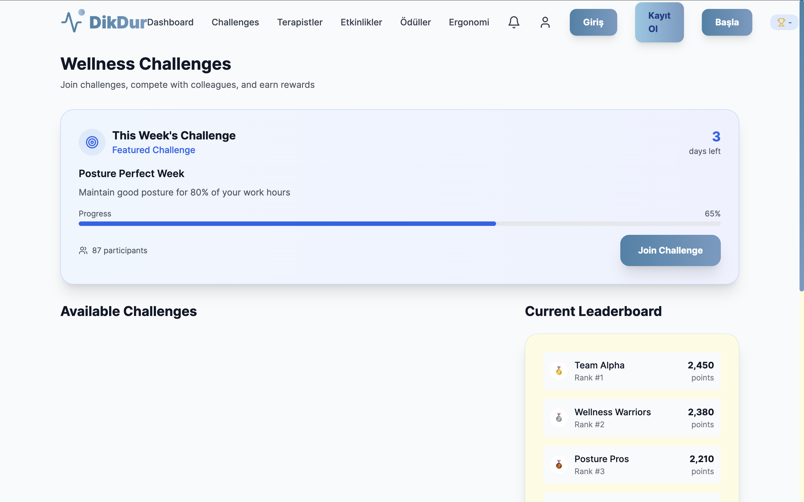

<h3>🔹 Challenges Screen</h3>

---

### 🗂 **PROJECT MANAGEMENT**  

All Sprint 2 tasks were assigned, tracked, and reviewed via [ClickUp](https://app.clickup.com/90151335937/v/dc/2kyq0e01-735).  
- Feature implementations were divided into smaller tasks  
- Progress was monitored through the ClickUp board  
- Color palette decisions and pair programming matches were voted directly within ClickUp discussions
  
#### Sprint Board  
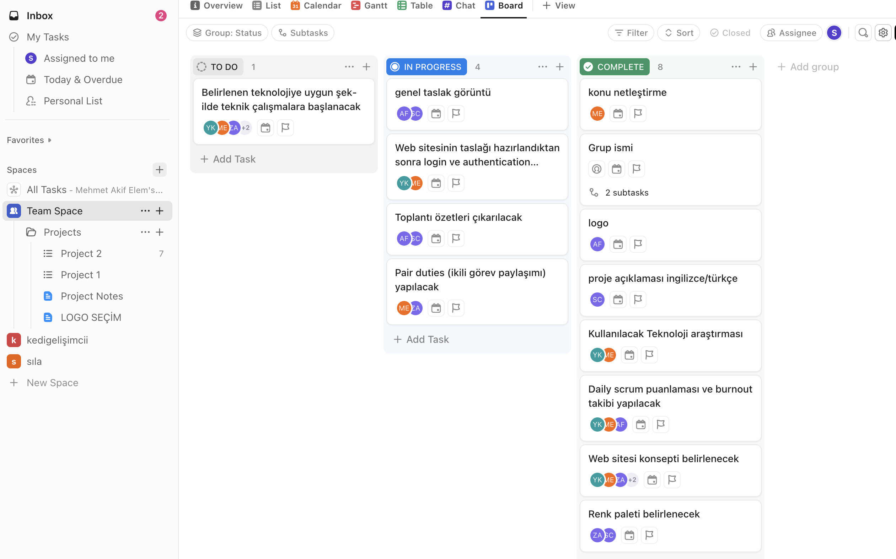

---

## **🏃 Sprint Scoring (Sprint 2 Task Table)**

| Task                                                                 | Priority       | Points | Status   |
|----------------------------------------------------------------------|----------------|--------|----------|
| Decide color palette                                                 | 🔴 High        | 5      | ✅ Done   |
| Assign pair programming duties                                       | 🔴 High        | 10     | ✅ Done   |
| Daily Scrum scoring & burnout tracking                               | 🔴 High        | 10     | ✅ Done   |
| Daily WhatsApp chats added regularly to GitHub                       | 🔴 High        | 10     | ✅ Done   |
| Write meeting summaries                                              | 🔴 High        | 10     | ✅ Done   |
| Write and edit README file                                           | 🔴 High        | 10     | ✅ Done   |
| Design Figma layout                                                  | 🔴 High        | 20     | ✅ Done   |
| Set up login and authentication after draft website is ready         | 🟠 Medium      | 30     | ✅ Done   |
| Start working on selected technology                                 | 🟠 Medium      | 20     | ✅ Done   |
| Define website concept                                               | 🟢 Low         | 15     | ✅ Done   |
| Decide which technology to use                                       | 🟢 Low         | 10     | ✅ Done   |

**✅ Total Points: 150 — All tasks completed!**
We maintained a burndown chart to track sprint velocity and ensure on-time delivery of features.

Initial backlog estimation: 150 Story Points

Final delivery: 150 Story Points Completed

We earned 100 points in the first sprint and 150 points in the second. With the third sprint, our goal is to reach a total of 400 points. This shows how our teamwork and communication keep improving each sprint.

## 🏃 Sprint 2 Burndown Chart 
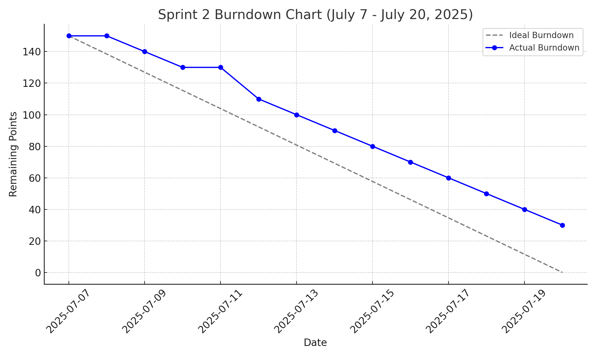

---
### 💬 **WHATSAPP CHAT**  
Daily coordination and updates were managed on WhatsApp:  
- Task follow-ups  
- Urgent issue resolutions  

Here are some screenshots from our WhatsApp communication and workflow discussions:

  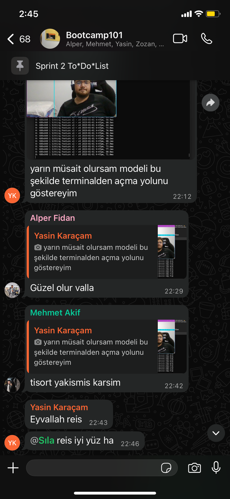
  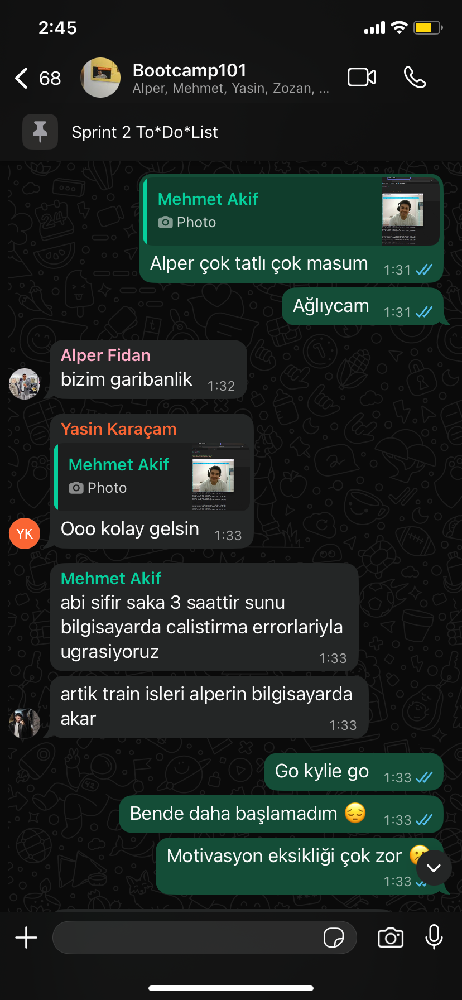
  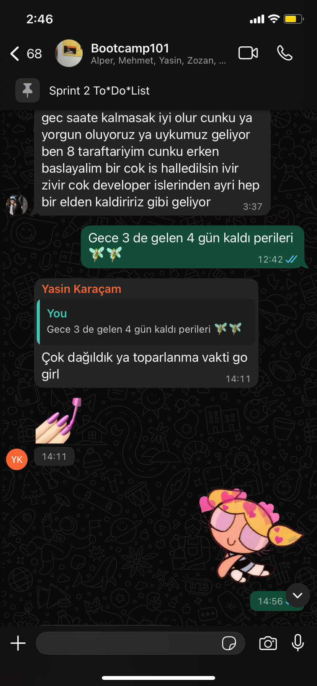
  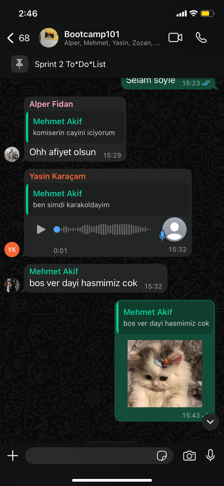
  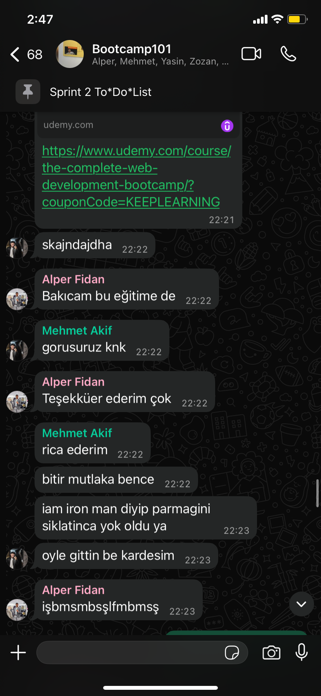

---

### 🖥️ Sprint 2 Meeting Screenshots

Throughout Sprint 2, meetings were conducted regularly via **Microsoft Teams** and **Google Meet** to coordinate tasks, monitor progress, and discuss technical challenges.  
Key sessions included:  
- **Sprint Planning** and **Mid-Sprint Review**  
- **Code Merge Discussions** and **Feature Implementation Alignment**

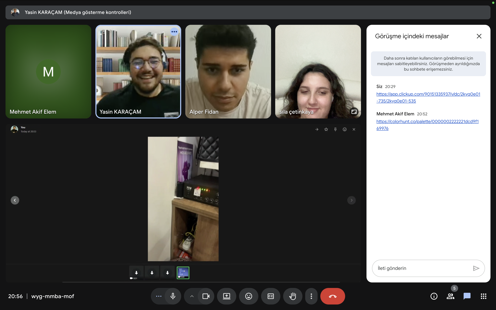
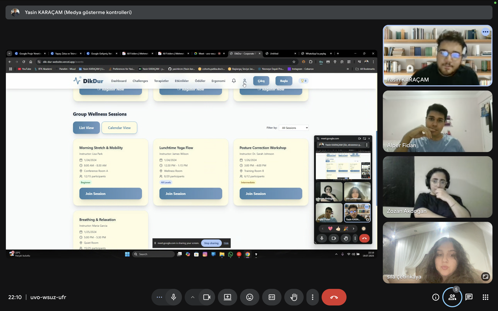
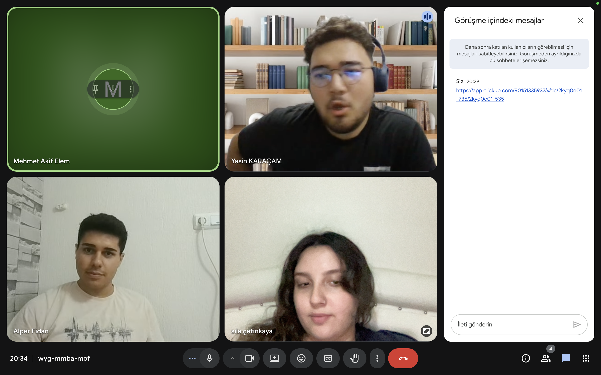

---
## 🔄 Daily Scrum Summary (Sprint 2)

During Sprint 2, daily stand-ups were held primarily through asynchronous updates on WhatsApp, complemented by weekly live meetings on Microsoft Teams or Google Meet.

### Format:
- What did you do yesterday?  
- What will you do today?  
- Any blockers?

### Highlights:

| Date       | Summary                                                                                     |
|------------|---------------------------------------------------------------------------------------------|
| July 8     | Started backend integration for posture analytics.                                         |
| July 9     | Continued work on gamification logic; initial tests conducted.                             |
| July 10    | Fixed bugs in posture data processing; discussed API endpoints.                           |
| July 11    | Mid-sprint review meeting; adjusted task priorities and responsibilities.                 |
| July 14    | Integrated feedback from sprint review; started virtual appointment module design.        |
| July 15    | Worked on data synchronization between backend and frontend components.                   |
| July 16    | Team members reviewed each other's code and resolved merge conflicts.                     |
| July 17    | Addressed blockers related to deployment; coordinated final sprint tasks.                 |
| July 18    | Finalized gamification features; prepared for sprint demo.                                |
| July 19    | Conducted pre-demo testing; documented issues and fixes.                                  |
| July 20    | Sprint demo and retrospective meeting; planned for next sprint.                           |

### Observations:
- Asynchronous communication helped accommodate different schedules.  
- Some blockers were resolved through quick team chats or pair programming sessions.  
- Team members supported each other to overcome knowledge gaps.  

---
## 🗒️ Sprint 2 Notes

- 🟢 **Sprint Start Date:** July 7, 2025  
- 🔚 **Sprint End Date:** July 20, 2025  
- 🕒 **Sprint Duration:** 2 weeks

### 📌 General Notes:

- Sprint 2 focused on developing core features of the DikDur platform and preparing a working prototype.
- The team worked on backend functionality, posture analytics integration, gamification logic, and virtual appointment setup.
- Task tracking was managed via **GitHub Projects**, with design collaboration through **Figma**.
- Meetings were mostly held online via **Microsoft Teams** and **Google Meet** due to vacation and internship schedules.
- Communication was maintained asynchronously via WhatsApp to accommodate members who were traveling or working.
- Task responsibilities were balanced based on each member’s availability and expertise.
- Despite varying levels of knowledge and external commitments, the team successfully completed 100% of planned story points.

### 🧩 Key Discussions & Decisions:

- Adjustments were made to feature priorities after mid-sprint review.
- Backend tasks were focused on enabling posture data analytics and integrating gamification challenges.
- Virtual appointment interface development was planned for Sprint 3 to maintain focus.
- Emphasis was placed on clear communication and collaborative code reviews.

---
## 🚀 Sprint 2 Review & Retrospective

### ✅ Sprint 2 Review

During Sprint 2, significant progress was made in the development of the DikDur platform. We focused on building out the core user-facing components and ensuring that the user flow became more consistent and intuitive. Key accomplishments include:

- The initial version of the **DikDur web platform** was successfully deployed: [dik-dur-website.vercel.app](https://dik-dur-website.vercel.app/)
- Several critical user interfaces were designed and partially implemented:
  - **Login and Registration pages**
  - **HR Dashboard** with posture analytics
  - **Gamification Panel** for challenges and rewards
  - **Virtual Appointment Interface** for physiotherapy sessions
- Navigation between screens was established.
- Design assets (e.g., Figma files) were shared to align development with visual design.

Despite these achievements, Sprint 2 also presented several collaboration and timing challenges.

---

### ⚠️ Challenges Faced During Sprint 2

- 🏖️ **Vacation & Mobility Issues**  
  The sprint took place during the summer break, which meant that many team members were traveling or temporarily unavailable. This affected meeting consistency and timely task completion.

- 💼 **Internship Commitments**  
  Several team members were also doing internships. Their differing schedules made synchronous collaboration difficult and reduced working hours across the team.

- 📚 **Knowledge Gaps**  
  There were noticeable differences in experience and familiarity with tools among team members. Some had advanced technical knowledge while others were still learning, which caused task imbalances and delays.

- 💬 **Asynchronous Communication**  
  Most of our communication happened on WhatsApp and other asynchronous platforms due to differing schedules. While this kept the team connected, it made quick decision-making and technical alignment harder.

---

### 🔁 Retrospective – Lessons Learned & Recommendations

| Observation | Recommendation |
|-------------|----------------|
| Sprint overlapped with vacations and internships | Use availability calendars before sprints and assign critical tasks accordingly |
| Technical experience levels varied | Encourage mentoring, pair programming, and mini knowledge-sharing sessions |
| Members changed locations often | Set fixed weekly check-ins regardless of location, with summaries for absentees |
| Overreliance on asynchronous chats | Use shared tools  for central task tracking and decisions |
| Lack of documented decisions | Rotate a note-taker each meeting and maintain a visible sprint log |

---

### 📌 Looking Ahead – Sprint 3 Goals

- Begin backend integration: user authentication, HR module, and user data handling
- Complete gamification system implementation
- Prepare and execute early user testing for core flows
- Improve internal processes through better scheduling and knowledge alignment

  
<h1>Sprint 3</h1>

  
  

---
## 🌐 Website

The official website of the **DikDur** project is now live:  
🔗 [https://dik-dur-website.vercel.app/](https://dik-dur-website.vercel.app/)

On this platform, users can discover the app's key features, learn about posture analysis techniques, and explore insights on workplace wellness. The website offers a clean, intuitive interface designed for a smooth user experience.

---

## ✅ Website Screenshots

Below are screenshots highlighting the main features and user interface of the website:

---

## 🗂 Project Management

You can view the Sprint 3 board on ClickUp here:  
🔗 [Sprint 3 ClickUp Board](https://app.clickup.com/90151335937/v/l/2kyq0e01-315)

---

## 🏃 Sprint Scoring – Sprint 3 Task Table

| Task                                                                                         | Priority   | Points | Status   |
|----------------------------------------------------------------------------------------------|------------|--------|----------|
| Remove the Challenges feature                                                                | 🔴 High    | 10     | ✅ Done   |
| Remove the Therapists section                                                                | 🔴 High    | 10     | ✅ Done   |
| Remove Notifications                                                                         | 🔴 High    | 10     | ✅ Done   |
| Fix token reading issue on Dashboard (use cache)                                             | 🔴 High    | 20     | ✅ Done   |
| Fix token processing delay after login                                                       | 🔴 High    | 20     | ✅ Done   |
| Add Posture Cam 10-second analysis delay logic                                               | 🔴 High    | 20     | ✅ Done   |
| After 10 seconds, show average of all cached posture values                                  | 🔴 High    | 15     | ✅ Done   |
| Improve the Ergonomy screen                                                                  | 🟠 Medium  | 15     | ✅ Done   |
| Redesign the Rewards section                                                                 | 🟠 Medium  | 15     | ✅ Done   |
| Show message: "Analyzing..." during Posture Cam scan                                         | 🟠 Medium  | 5      | ✅ Done   |
| Update the Activities section                                                                | 🟢 Low     | 10     | ✅ Done   |
| Redesign the Logo                                                                            | 🟢 Low     | 5      | ✅ Done   |

🎯 **Total Story Points (Sprint 3):** 165  
✅ **Completion:** 100%

---

## 📉 Sprint 3 Burndown Chart

---

## 💬 Communication Summary

- Daily Scrum updates via **WhatsApp**
- Weekly meetings over **Google Meet**
- Task updates centralized in **ClickUp**
- Asynchronous communication allowed flexibility during internships and summer holidays

  ## Sprint 3: WhatsApp Chat Screenshots

  Our team got along really well, and the camaraderie was truly wonderful. We did our daily tracking through WhatsApp, which helped us stay connected and organized. Now, we're feeling a bit sad that the project is coming to an end because we enjoyed working together so much.

  

  
   
  
  

---

## 🗓️ Daily Scrum Log

| Date       | Summary                                                                                     |
|------------|---------------------------------------------------------------------------------------------|
| July 20    | Sprint planning and backlog review                                                          |
| July 21    | Identified token bug and initiated fix                                                      |
| July 22    | Removed unused sections (Challenges, Notifications)                                        |
| July 23    | Worked on Posture Cam logic                                                                 |
| July 24    | Integrated posture data caching                                                             |
| July 25    | Redesign discussions: Ergonomy and Rewards                                                  |
| July 26    | Implemented averaging logic and "Analyzing..." feedback                                     |
| July 27    | Tested authentication caching                                                               |
| July 28    | Updated Activities section and integrated new logo                                          |
| July 29    | Internal code review and cleanup                                                            |
| July 30    | Final UI polish and MVP confirmation                                                        |
| July 31    | Demo preparations and final QA                                                              |
| August 1   | README updated, review checklist completed                                                  |
| August 2   | Last adjustments and final testing                                                          |
| August 3   | Sprint closed, retrospective notes written                                                  |

## Sprint 3 Daily Scrum Summary

During Sprint 3, our team focused on planning, bug fixing, feature development, and polishing the project for the final release. We started with sprint planning and backlog review, quickly identifying and fixing a critical token bug. Unnecessary sections like Challenges and Notifications were removed to streamline the app.

Key features developed included the Posture Cam logic, posture data caching, and averaging logic with user feedback improvements like the "Analyzing..." status. We also redesigned parts of the UI, including Ergonomy and Rewards, and integrated a new logo.

Throughout the sprint, we conducted internal code reviews, cleaned up the codebase, tested authentication caching, and finalized the user interface. The team worked collaboratively to prepare demos, update documentation, and complete the final QA.

By the end of the sprint, all planned goals were met, and we successfully closed the sprint with detailed retrospective notes.

---

## 🚀 Sprint 3 Review & Retrospective

### 🔍 What We Achieved
- 🔧 Major UI/UX improvements: Ergonomy, Rewards, Activities, and Logo
- 🧠 Implemented posture cam scanning with delay and result averaging
- 🚫 Cleaned up features: Removed Challenges, Notifications, and Therapists
- ⚙️ Resolved backend token caching issues for faster authentication

### 💡 Lessons Learned

| Observation                              | Action Taken                                                 |
|------------------------------------------|--------------------------------------------------------------|
| Token management was unclear             | Created backend logic documentation                          |
| Mid-sprint motivation drop               | Weekly demo checkpoints introduced                           |
| Task load was uneven                     | Used ClickUp assignments to balance workload                 |
| Fragmented communication                 | Centralized updates in GitHub and ClickUp                    |

---

## 🏁 Final Project Summary

With the successful completion of Sprint 3, the DikDur project reached its initial MVP goals. Over three sprints, the team progressed from ideation to deployment, delivering a functional posture analysis web platform.

### 🌟 Highlights from All Sprints
- 🎯 **Total Story Points Completed:** 415
- ✅ **MVP Delivered:** Posture Cam, HR Dashboard, Gamification, Analytics
- 🌐 **Live Demo:** [dik-dur-website.vercel.app](https://dik-dur-website.vercel.app)
- 🤝 Strong collaboration across ClickUp, GitHub, Figma, and Google Meet

### 🛠️ Tech Stack
- Frontend: React.js  
- Styling: Tailwind CSS  
- Backend: Node.js *(planned)*  
- Tools: ClickUp, GitHub Projects, WhatsApp, Google Meet

### 📌 What's Next
- Mobile version and UI responsiveness
- Integration with physiotherapy systems
- Machine learning-based analytics
- Backend deployment for full-stack support

---

Thanks for following our journey in building **DikDur** – an AI-powered platform for healthier posture and happier workspaces! 🚀

  
<h1>Business Model Canvas</h1>

  

